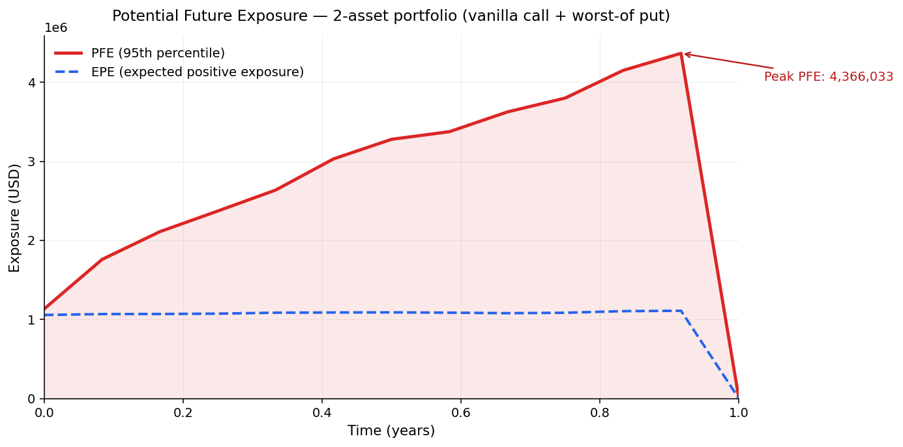
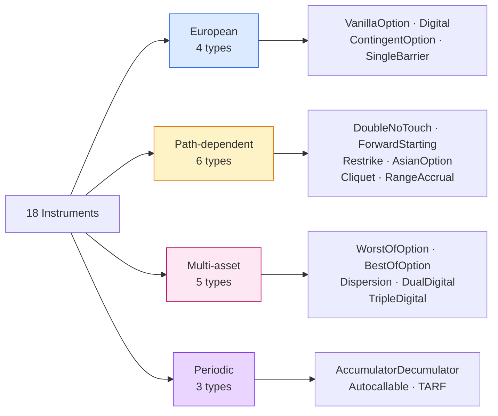

# PFE-v2

[](https://www.python.org/downloads/)
[](#license)
[](#tests)

A Python engine for computing **Potential Future Exposure (PFE)** on exotic derivatives using nested Monte Carlo simulation. Ships with 18 instrument types, 9 composable modifiers, and an interactive Streamlit UI.



*Above: the actual output of `examples/basic_pfe.py` — PFE (red) and EPE (blue) of a 2-asset portfolio (vanilla call + worst-of put) over a 1-year horizon. Peak PFE is ~$4.4M at month 11.*

---

## Contents

- [Why this exists](#why-this-exists)
- [The core idea](#the-core-idea-in-one-picture)
- [Install](#install)
- [Quick start](#quick-start)
- [What's inside](#whats-inside)
- [Streamlit UI](#streamlit-ui)
- [Documentation](#documentation)
- [Tests](#tests)
- [License](#license)

---

## Why this exists

When a bank or a brokerage sells a derivative to a client, the question *"how much could this client owe us if things go badly?"* is as important as the price of the trade itself. **Potential Future Exposure** is the industry's answer: the 95th-percentile (or 99th, etc.) of the positive mark-to-market value across every plausible future scenario.

PFE is the main input to:

- **Counterparty credit risk capital** (SA-CCR, IMM)
- **Credit Value Adjustment (CVA)** pricing
- **Credit limits and pre-deal checks** on the trading desk
- **Initial margin / MPoR exposure** for collateralised books

Commercial engines (Murex, Calypso, Numerix) do this well but cost millions and are black boxes. **PFE-v2 is a clean-room, readable, hackable Python implementation** that covers most of the light-exotic product space a mid-tier institution actually trades.

## The core idea in one picture

PFE-v2 runs a **nested Monte Carlo**: first it simulates many future market scenarios, then at every point in every scenario it re-prices the whole portfolio with a second Monte Carlo to get a mark-to-market value. The collection of those MtMs becomes the exposure distribution.

```mermaid
flowchart TB
    A[MarketData + Portfolio + PFEConfig] --> B[Outer MC — simulate<br/>n_outer correlated market scenarios<br/>over time grid]
    B --> C{For each scenario<br/>at each time step}
    C --> D[Inner MC — re-price<br/>every trade with n_inner<br/>forward-looking paths]
    D --> E[MtM matrix<br/>n_outer × T_steps]
    E --> F[Exposure = max&#40;MtM, 0&#41;]
    F --> G[PFE = 95th percentile<br/>EPE = mean<br/>EEPE = Basel III effective EPE]
    G --> H[PFEResult]

    style B fill:#dbeafe,stroke:#2563eb
    style D fill:#fee2e2,stroke:#dc2626
    style G fill:#dcfce7,stroke:#16a34a
```



The outer loop generates the *market* (what could happen). The inner loop prices the *book* in each of those markets. Correlation across assets is handled via Cholesky decomposition of the input correlation matrix.

Because inner MC at every outer node is expensive, the engine vectorises European payoffs across all outer paths at once, falling back to per-path loops only for genuinely path-dependent instruments. At production scale (`5000 × 52 × 2000` = 260K inner invocations) a typical run takes ~60 seconds on one CPU. (The optional Numba backend currently only accelerates the outer GBM simulation; the inner MC chunked pricer uses NumPy directly. Wiring the backend through inner MC is a known follow-up.)

### Modeling assumptions

Deliberate simplifications a model-validation reviewer should know about:

- **Dynamics**: multivariate geometric Brownian motion with flat (constant) vols, rates, and correlations. No stochastic vol, no local vol, no rate curves.
- **Measure**: the *outer* scenarios are simulated under the risk-neutral measure (drift `r − σ²/2`), the same measure used for inner pricing. Production PFE engines typically simulate outer scenarios under the real-world measure with estimated drifts; using Q for both is a common simplification that avoids a drift-calibration step.
- **Discounting**: all cashflows are discounted at the flat `domestic_rate`. Periodic instruments (`Autocallable`, `TARF`, `AccumulatorDecumulator`) discount each cashflow from its own payment date; everything else pays at maturity. Modifier-wrapped trades are valued as paying at maturity, since modifiers transform the aggregate payoff.
- **Settlement**: a trade's exposure drops to zero after its maturity (or early-termination) date — settled cashflows are not carried as exposure.

## Install

```bash
pip3 install -e .                    # core only
pip3 install -e ".[ui]"              # + Streamlit UI
pip3 install -e ".[ui,numba,plot]"   # everything
```

Requires Python 3.10 or newer.

## Quick start

```python
import numpy as np
from pfev2 import MarketData, PFEConfig, compute_pfe
from pfev2.instruments import VanillaOption, WorstOfOption

market = MarketData(
    spots=np.array([100.0, 50.0]),
    vols=np.array([0.20, 0.30]),
    rates=np.array([0.05, 0.05]),
    domestic_rate=0.05,
    corr_matrix=np.array([[1.0, 0.5], [0.5, 1.0]]),
    asset_names=["AAPL", "XYZ"],
    asset_classes=["EQUITY", "EQUITY"],
)

portfolio = [
    VanillaOption(trade_id="C1", maturity=1.0, notional=100_000,
                  asset_indices=(0,), strike=100.0, option_type="call"),
    WorstOfOption(trade_id="WP1", maturity=1.0, notional=100_000,
                  asset_indices=(0, 1), strikes=[100.0, 50.0], option_type="put"),
]

config = PFEConfig(n_outer=500, n_inner=500, seed=42, grid_frequency="monthly")
result = compute_pfe(portfolio, market, config)
print(result.summary())
```

```
Peak PFE:          3,936,197.30
EEPE:              1,055,839.29
Confidence:        95%
Outer paths:       500
Inner paths:       500
Margined:          False
Horizon:           12 months
Computation time:  0.2s
```

For three worked examples (basic equity, FX accumulator with knock-out, multi-asset basket), see [`examples/`](examples/).

## What's inside

**18 instruments** organised by how they are priced:



**9 modifiers** that wrap any instrument using a decorator pattern, and chain together (e.g. `PayoffCap(KnockOut(VanillaOption(...)))`):

| Group | Modifiers | What they do |
|---|---|---|
| Barriers | `KnockOut`, `KnockIn`, `RealizedVolKnockOut`, `RealizedVolKnockIn` | Kill or activate the trade when spot (or realised vol) crosses a level |
| Payoff shapers | `PayoffCap`, `PayoffFloor`, `LeverageModifier` | Cap, floor, or scale the final payoff |
| Structural | `ObservationSchedule`, `TargetProfit` | Custom observation dates; auto-terminate at a profit target |

Full payoff formulas, parameter lists, and economic commentary for every instrument and modifier live in the **[wiki](https://github.com/leeduoduo211/PFE-v2/wiki)**.

## Streamlit UI

```bash
python3 -m streamlit run ui/app.py
```

A 4-step wizard (**Market → Portfolio → Config → Results**) with a registry-driven form builder — add a new instrument to the registry and its trade-builder form, term sheet, and payoff display are generated automatically. There's also a single-page **Dashboard** mode for power users.

## REST API

```bash
pip3 install -e ".[api]"
python3 -m uvicorn api.app:app --reload   # interactive docs at /docs
```

A FastAPI layer over the same engine, serving the React frontend (the Streamlit app is unaffected). All routes are under `/api`:

| Endpoint | What it does |
|---|---|
| `GET /api/registry` | Instrument + modifier field schemas — the same data that drives the Streamlit forms |
| `POST /api/t0-mtm` | Synchronous per-trade t=0 MtM preview |
| `POST /api/runs` | Validate inputs, queue a PFE run in a background thread, return `202` + run id |
| `GET /api/runs`, `GET /api/runs/{id}` | Run history / status |
| `GET /api/runs/{id}/events` | Server-Sent Events stream of progress until the run is terminal |
| `GET /api/runs/{id}/result` | Full result (curves, EEPE, config echo; `?include_mtm=true` for the MtM matrix) |

Request payloads use the same trade-spec dict format as the UI (`{trade_id, instrument_type, direction, params, modifiers}`); validation errors come back as specific `422`s at submission time. Set `PFEV2_DB_PATH` to persist run history to SQLite — terminal runs reload on restart.

## React frontend

```bash
python3 -m uvicorn api.app:app           # terminal 1 — backend
cd frontend && npm install && npm run dev # terminal 2 — http://localhost:5173
```

A Vite + React + TypeScript SPA over the REST API, with the visual design ported from the [design system](design/) (same tokens, same `pfe_light` chart styling). Trade forms for all 18 instruments and 9 modifiers are generated from `GET /api/registry` — adding an instrument to the Python registry lights it up here with no frontend change. Runs stream live progress over Server-Sent Events; results render KPI cards, the PFE/EPE profile, and per-trade MtM. See [`frontend/README.md`](frontend/README.md).

## Docker

A single container builds the SPA and serves it from FastAPI alongside the API:

```bash
docker build -t pfev2 .
docker run -p 8000:8000 -v pfev2-data:/data pfev2   # app at http://localhost:8000
```

The image bundles the engine, the API, and the built frontend; run history persists to the `/data` volume. The Streamlit app is not part of the image.

## Documentation

- **[Wiki — Home](https://github.com/leeduoduo211/PFE-v2/wiki)** — full documentation
- **[Architecture](https://github.com/leeduoduo211/PFE-v2/wiki/Architecture)** — how the engine is built
- **[Instruments](https://github.com/leeduoduo211/PFE-v2/wiki/Instruments)** — every product with payoff formula and use case
- **[Modifiers](https://github.com/leeduoduo211/PFE-v2/wiki/Modifiers)** — how wrapping works
- **[Mathematical Foundations](https://github.com/leeduoduo211/PFE-v2/wiki/Mathematical-Foundations)** — the SDE, Cholesky, quantile estimator
- **[FAQ](https://github.com/leeduoduo211/PFE-v2/wiki/FAQ)** — common questions and pitfalls

## Tests

```bash
python3 -m pytest tests/ -v
```

333 tests covering instruments, modifiers, engine, risk aggregation, UI converters, and the REST API (including run persistence and the SSE stream). See [`CHANGELOG.md`](CHANGELOG.md) for change history.

## License

MIT — see [LICENSE](LICENSE).
